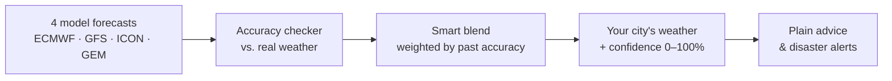
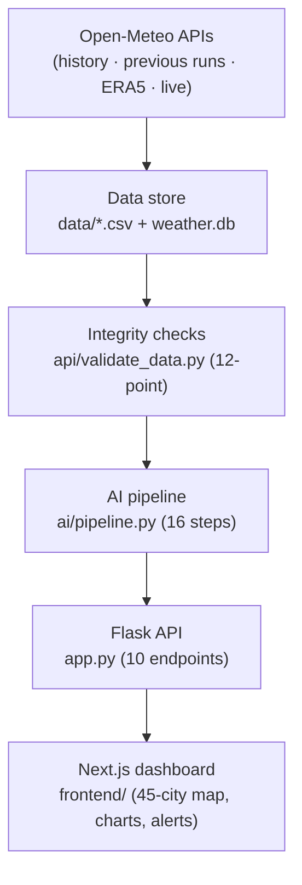
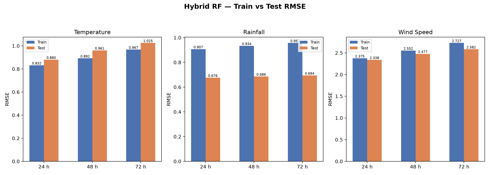
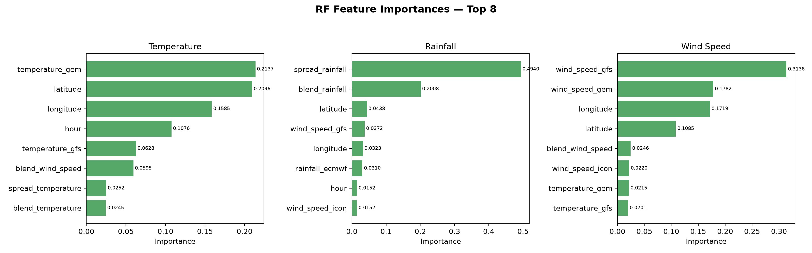
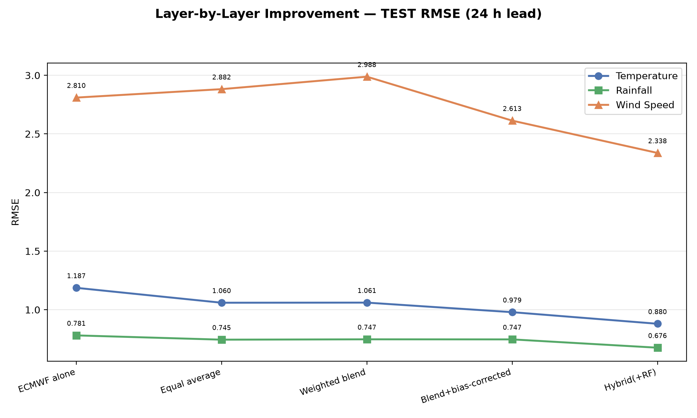
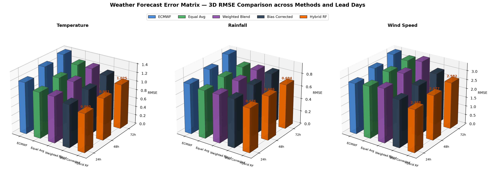

# Prakruti · प्रकृति

[](https://sih.gov.in/)
[](https://sih.gov.in/)
[-green.svg)](https://moes.gov.in/)
[]()
[](https://prakruti-ten.vercel.app)

> **One weather answer for your city — blended from four, with a confidence score you can check.**

---

## What is Prakruti?

Prakruti is like a weather app that checks **4 different forecasts** — from the world's
leading prediction systems (ECMWF, GFS, ICON, GEM) — works out **which one is most
reliable for your city right now**, and blends them into a single answer.

Then it does what most apps don't:

- it tells you **how confident** it is, on a 0–100% scale, with the reasoning shown,
- and it turns the numbers into plain advice for the next **72 hours**.

## How it works



## What you get

| You ask | Prakruti answers |
| :--- | :--- |
| *Will it rain this evening?* | Hourly rainfall, temperature and wind for the next 72 hours |
| *Is it safe to plan outdoor work?* | Early warnings for heatwaves, heavy rain and high winds |
| *How bad could it get?* | A 0–100 Risk Priority Index with readiness levels for disaster agencies |
| *Which forecast should I trust today?* | A per-city accuracy score for each of the 4 models |

## The numbers that matter

| | |
| :--- | :--- |
| **45** Indian cities | **72** hours ahead, hour by hour |
| **4** global models, blended | **1M+** hourly records across 61 days of history |
| **0–100%** confidence on every forecast | **D+1 / D+2 / D+3** accuracy tracked separately |

## Try it

```bash
# Backend (Python 3.10+)
pip install -r requirements.txt
python app.py                      # API on http://localhost:5000

# Dashboard (Node 18+), in a second terminal
cd frontend && npm install
npm run dev                        # UI on http://localhost:3000
```

---

# For engineers

**Prakruti** is a hybrid AI–NWP multi-model weather forecast blending platform built for
Smart India Hackathon 2026 (PS-26081, Ministry of Earth Sciences / NCMRWF). It blends
physics-based NWP model output with machine-learning calibration and an explainable
confidence engine for temperature, precipitation and wind across 45 Indian cities.

## Architecture



## Tech stack

[](https://nextjs.org/)
[](https://react.dev/)
[](https://www.typescriptlang.org/)
[](https://tailwindcss.com/)
[](https://leafletjs.com/)
[](https://www.python.org/)
[](https://flask.palletsprojects.com/)
[](https://scikit-learn.org/)
[](https://pandas.pydata.org/)
[](https://numpy.org/)
[](https://www.sqlite.org/)

| Layer | Tools |
| :--- | :--- |
| Frontend | Next.js 15, React 19, TypeScript 5, Tailwind CSS v4, Leaflet, Recharts |
| Backend | Python 3.10+, Flask 3, SQLite, dual-engine parsing (pandas → stdlib `csv`) |
| AI / ML | scikit-learn Random Forests, NumPy/pandas, inverse-RMSE weighting, joblib |

## Blending pipeline

`python ai/pipeline.py` runs 16 stages end to end. The core ones:

| Stage | What it does |
| :--- | :--- |
| `skill_lead.py` | Verifies every model against ERA5 actuals, per city, variable and lead day (D+1/2/3) |
| `weights_lead.py` | Converts those errors into lead-adaptive weights: w ∝ 1/RMSE² |
| `blend_lead.py` / `blend_current.py` | Produces the weighted consensus forecast |
| `train.py` | Random Forest regressors remove residual terrain and diurnal biases |
| `confidence_engine.py` | 0–100% confidence = 50% skill + 30% inter-model agreement + 20% lead decay |
| `alerts.py` | Heatwave, cloudburst and windstorm thresholds → hazard alerts |

The Flask API serves the results: `/api/forecast`, `/api/weights`, `/api/skill`,
`/api/confidence`, `/api/alerts`, `/api/rpi`, `/api/cities`, `/api/rpi/map`,
`/api/metadata`, `/`. The cache manager refreshes the live 72-hour window every 6 hours.

## Datasets

| File | Source | Rows |
| :--- | :--- | ---: |
| `data/forecast_history.csv` | Historical Forecast API (61 days, 4 models) | 263,520 |
| `data/forecast_history_lead.csv` | Previous Runs API (61 days × 4 models × 3 leads) | 790,560 |
| `data/actual_history.csv` | Archive API (ERA5 reanalysis ground truth) | 65,880 |
| `data/forecast_current.csv` | Forecast API (rolling 72-hour window) | 12,960 |

All timestamps are Asia/Kolkata (IST). Run `python api/validate_data.py` for the
12-point integrity diagnostic before training.

## Model performance

<p>
  
  
</p>
<p>
  
  
</p>

## Live

- Dashboard: https://prakruti-ten.vercel.app
- API: https://prakruti-api.onrender.com

The free-tier API sleeps after ~15 min idle; the first request wakes it
(keep-awake cron pings every 5 minutes, and the dashboard retries for 60 s).

## Deployment

Backend runs on Render (`render.yaml` → https://prakruti-api.onrender.com), frontend
on Vercel (https://prakruti-ten.vercel.app). Local development uses the two commands
above; both services read the committed configuration files. What ships to each
target, and what enforces it, is in [docs/DEPLOYMENT.md](docs/DEPLOYMENT.md).

## Team EXELION

| # | Name | Role |
|---|------|------|
| 1 | Palak Srivastava | Team Lead |
| 2 | Prachi Jha | Member |
| 3 | Mahima Shukla | Member |
| 4 | Om Vishwakarma | Member |
| 5 | Patel Ashish Suresh | Member |
| 6 | Param Gupta | Member |

## Acknowledgments

Weather data from [Open-Meteo](https://open-meteo.com) (ECMWF IFS, NOAA GFS, DWD ICON,
CMC GEM) and ERA5 reanalysis via the Copernicus Climate Change Service. Built for
Smart India Hackathon 2026 — PS-26081, Ministry of Earth Sciences (NCMRWF).

Hand-drawn animated icons are vendored from [ItsHover](https://itshover.com)
(Apache-2.0) into `frontend/src/components/icons/`; `index.ts` there re-exports them
under the lucide names the app already used. The brand's split-flap board is the
[SplitFlapText](https://reactbits.dev) component from React Bits, adapted for
Devanagari.
